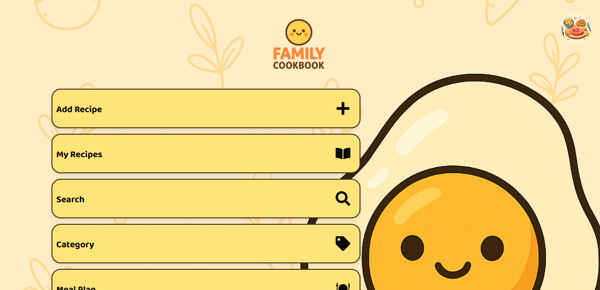
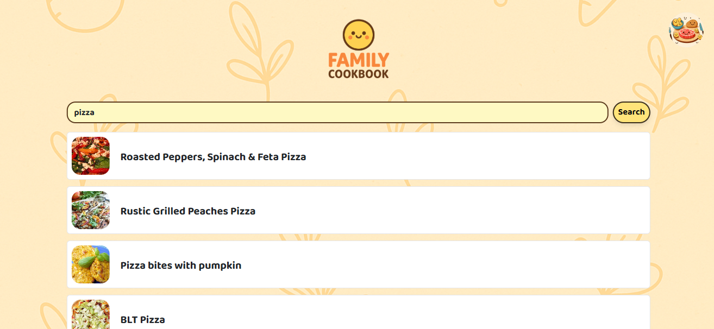
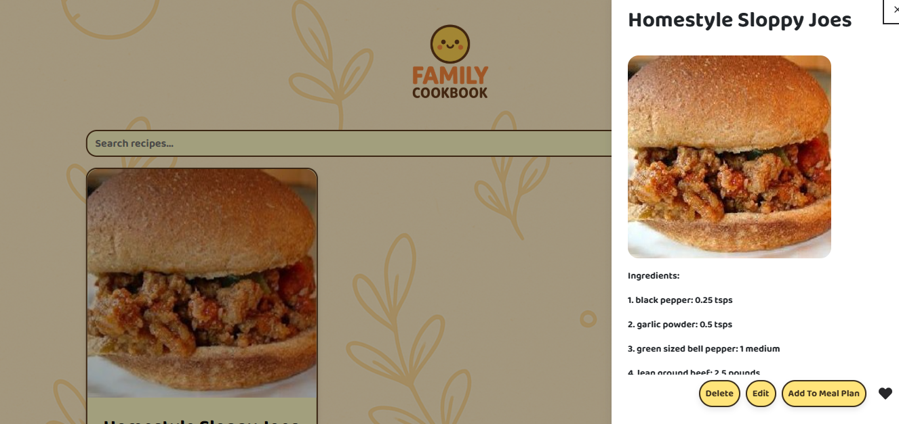

# 👨‍🍳 Family Cookbook

A full-stack Family Cookbook application that allows users to store, search, and manage their favorite recipes. Built using **Node.js**, **Express.js**, **React (with Chakra UI)**, **PostgreSQL**, and **Docker**, it integrates with the **Spoonacular API** for powerful recipe search features.

---

## 🚀 Features

- User authentication with encrypted password storage (`bcrypt`) and token session management (`jsonwebtoken`)
- Add, edit, delete, and categorize custom recipes
- Search and save recipes from the Spoonacular API by name or ingredients
- Edit notes and categorize saved recipes
- Create and manage personalized meal plans
- Mark recipes as favorites
- Supports multiple users with separate accounts
- Session-based authentication (expires when browser session closes)
- Fully containerized with Docker and Docker Compose
- Responsive UI built with Chakra UI

---

## 🖼️ Screenshots





---

## 🧱 Tech Stack

- **Frontend**: React + Chakra UI
- **Backend**: Node.js + Express.js
- **Database**: PostgreSQL
- **API Integration**: [Spoonacular Food API](https://spoonacular.com/food-api)
- **Authentication**: bcrypt, jsonwebtoken
- **Deployment**: Docker, Docker Compose

---

## ⚙️ Getting Started

### 1. Prerequisites

- [Git](https://git-scm.com/)
- [Docker & Docker Compose](https://docs.docker.com/compose/install/)
- [PostgreSQL](https://www.postgresql.org/download/)
- Spoonacular API key (free — no credit card required)

### 2. Clone the Repository

```bash
git clone https://github.com/your-username/your-repo-name.git
cd your-repo-name
```
---

### 3. Setup PostgreSQL

Make sure PostgreSQL is installed and running on your machine.

1. Create a new database for the application.
2. Create a PostgreSQL user with access to that database.
3. Note down the host, port, user, password, and database name to configure in the `.env` file.

### 4. Configure Environment Variables

Create a `.env` file in the root directory of the project using the following structure (you can also copy from `.env.example`):

```env
REACT_APP_IP=localhost
REACT_APP_PORT=3000
REACT_APP_API_PORT=5000

DB_USER=your_db_user
DB_PASSWORD=your_db_password
DB_HOST=your_db_host
DB_PORT=5432
DB_NAME=your_db_name

SPOONACULAR_API=your_free_spoonacular_api_key
JWT_SECRET=ThisShouldBeARandomString
```
🔑 Note: You can generate a Spoonacular API key for free at spoonacular.com/food-api — no credit card required.

---

### 5. Run the Application

Use Docker Compose to build and run the application:

```bash
docker-compose --env-file .env up
```
This will spin up two containers:

`frontend`: React app running on `REACT_APP_PORT` (default: localhost:`3000`)

`backend`: Express API running on `REACT_APP_API_PORT` (default: localhost:`5000`)

🐘 Important: Ensure your PostgreSQL server is running and properly configured. If the database connection fails, the app will not start correctly.

---

### 6. API Access

All backend API routes are protected and require a valid session token. After logging in, tokens are managed with jsonwebtoken and persist for the browser session.

### License

This project is open-source and freely available for use.
